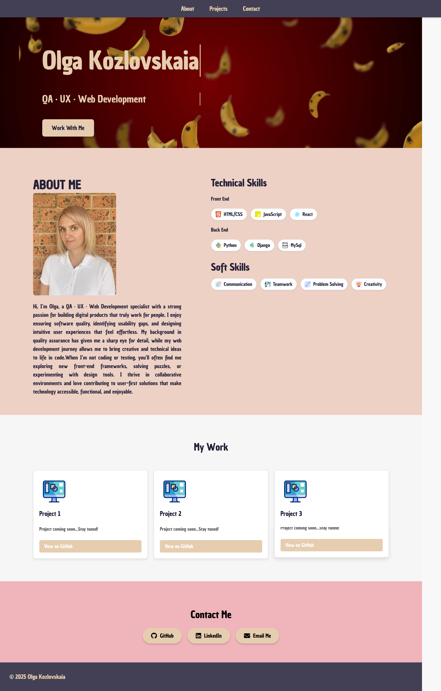
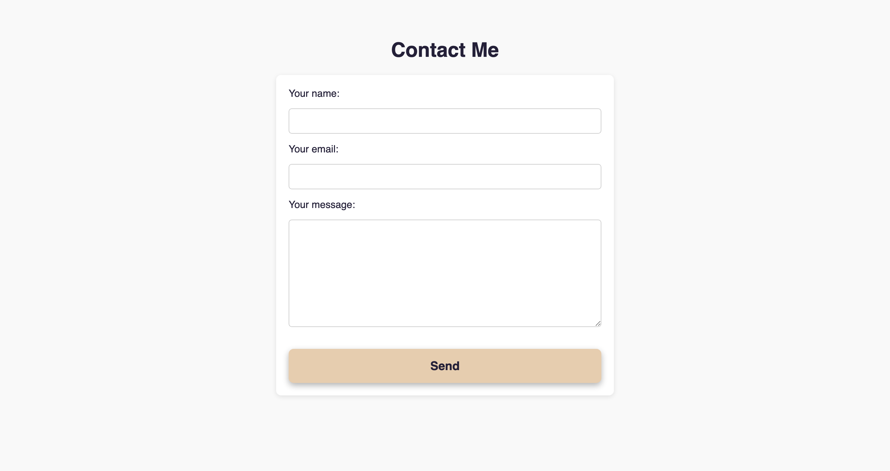
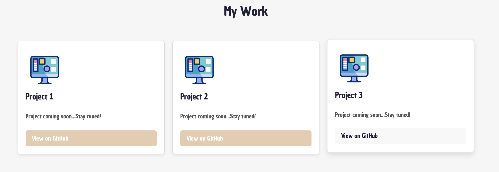

# Olga_Kozlovskaia - Portfolio Task

​
[My portfolio site](https://mmokaus.github.io/)
​

## Project Requirements

### Content

Add a short paragraph describing the features below. What aesthetic and technical choices did you make?

Used video in the hero section to grab attention, pulsating call-to-action button, sticky header section, icons for skills section, persistent font and colors

- [Y] At least one profile picture
- [Y] Biography (at least 100 words)
- [Y] Functional Contact Form
- [Y] "Projects" section
- [Y] Links to external sites, e.g. GitHub and LinkedIn.
  ​

### Technical

Add a short paragraph describing the features below. What strategies or design decisions did you work from?

Contact form opens in a separate page, flex adjustments for various screen sizes, project sections with previews (coming soon)

- [Y] At least 2 web pages. - main and functional contact form
- [Y] Version controlled with Git
- [Y] Deployed on GitHub pages.
- [Y] Implements responsive design principles.
- [Y] Uses semantic HTML.

### Bonus (optional)

Add a short paragraph describing the features below, if you included any.

Buttons change on hover, pulsating call-to-action button, typing text in hero section

- [Y] Different styles for active, hover and focus states.
- [ ] Include JavaScript to add some dynamic elements to your site. (Extra tricky!)
      ​

### Screenshots

> Please include the following:
>
> - The different pages and features of your website on mobile, tablet and desktop screen sizes (multiple screenshots per page and screen size).
> - The different features of your site, e.g. if you have hover states, take a screenshot that shows that.
>
> You can do this by saving the images in a folder in your repo, and including them in your readme document with the following Markdown code:

#### image_title_goes_here

